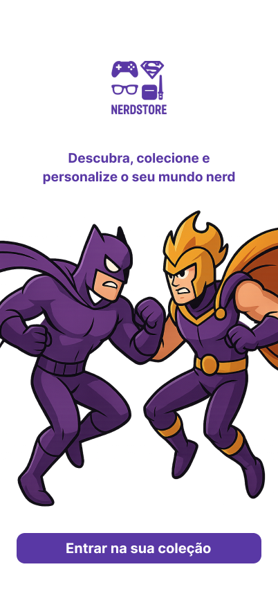
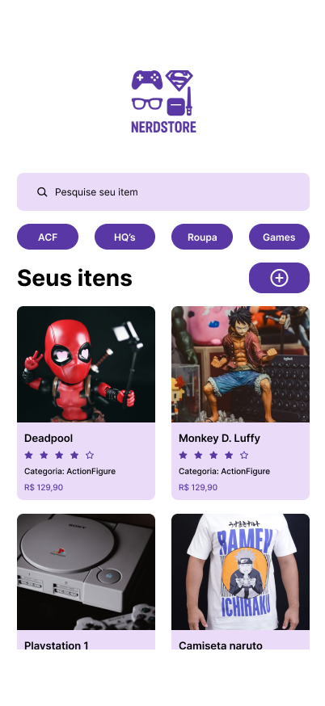
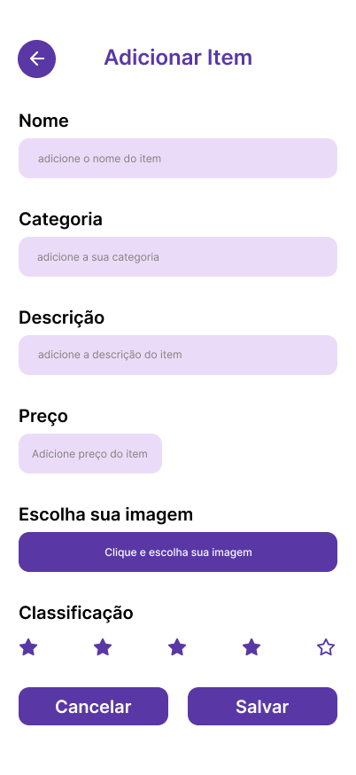
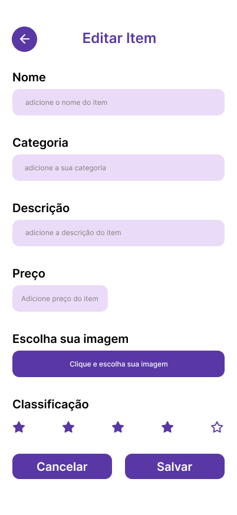
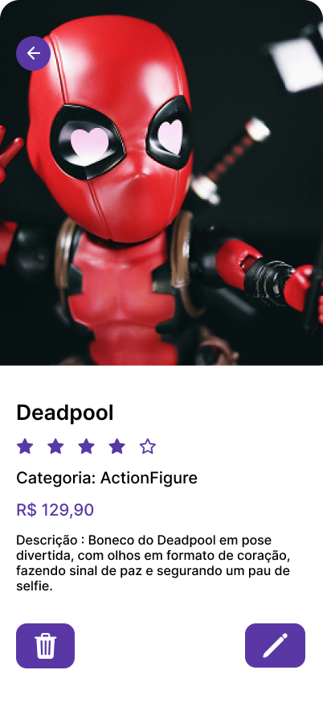
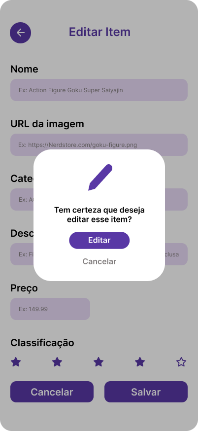
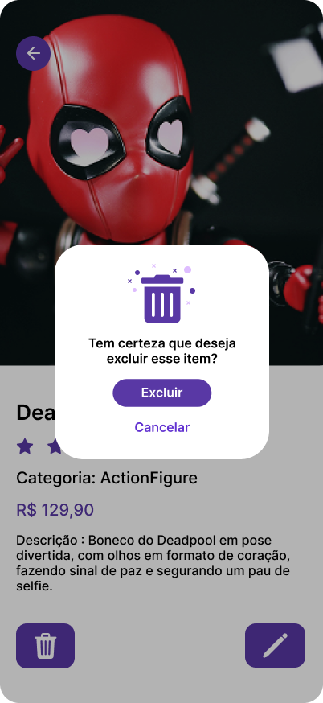
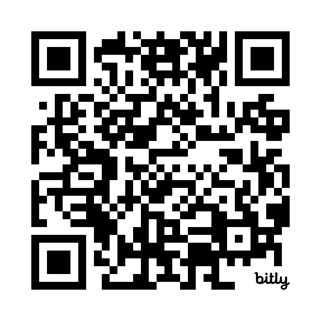

# 🛍️ NerdStore - Gerenciador de Itens Geek

Aplicativo mobile multiplataforma desenvolvido com **React Native + Expo**, integrado a uma **API Java Spring Boot** com banco de dados **MongoDB Atlas**, com o objetivo de gerenciar coleções pessoais de itens geek (filmes, HQs, action figures, jogos e outros).

---

## 📱 Sobre o Projeto

O **NerdStore** permite que usuários cadastrem, editem, visualizem e removam itens da sua coleção geek diretamente do celular. Ideal para colecionadores que desejam manter o controle de suas aquisições com agilidade, organização e praticidade.

---

## 🚀 Tecnologias Utilizadas

### 🔧 Front-End (Mobile)

- [React Native](https://reactnative.dev/)
- [Expo](https://expo.dev/)
- [Axios](https://axios-http.com/)
- [React Navigation](https://reactnavigation.org/)

### ☕ Back-End

- [Java 17](https://www.oracle.com/java/)
- [Spring Boot](https://spring.io/projects/spring-boot)
- [Spring Data MongoDB](https://spring.io/projects/spring-data-mongodb)
- [Swagger](https://swagger.io/) – para documentação da API

### 🗄️ Banco de Dados

- [MongoDB Atlas](https://www.mongodb.com/cloud/atlas)

---

## 🛠️ Funcionalidades

- ✅ Cadastro de itens com imagem, nome, descrição e preço
- ✅ Listagem de todos os itens cadastrados
- ✅ Edição de qualquer item
- ✅ Exclusão de itens
- ✅ Integração em tempo real com a API

---

## 📂 Estrutura de Pastas
```
📁 nerdstore-app
├── assets/
├── components/
├── screens/
├── services/
└── App.js

📁 nerdstore-api
├── controller/
├── model/
    ├── mapper
    └── dto
├── repository/
├── config/
└── exception/
```


---

## 📸 Telas do App









---

## 🧪 Como rodar localmente

### 🧰 Pré-requisitos

- Node.js
- Expo CLI
- Java 17+
- MongoDB Atlas com IP liberado
- IDEs recomendadas: VSCode (frontend), IntelliJ (backend)

### 🔧 Backend

```bash
# Clone o repositório e acesse o diretório
cd nerdstore-api

# Configure o application.properties com suas credenciais do MongoDB

# Execute a aplicação (Spring Boot)
./mvnw spring-boot:run
```

### 📱 Frontend
```bash
# Clone o repositório e acesse o diretório
cd nerdstore-app

# Instale as dependências
npm install

# Rode o projeto
npx expo start
```

### 🤳 Use o Expo Go no seu celular para escanear o QR code e testar.


## 📘 Documentação da API
### Acesse a documentação Swagger em:
```bash
https://nerdstore-api.onrender.com/swagger-ui/index.html
```

# Prototipamento do App
[Figma](https://www.figma.com/design/Cf2PmLNHyrTrRrY1gQF0CS/NerdStore?node-id=162-176&t=VdhVbNXiEw0vmBpX-0)

# Faça o Download do nosso Apk


## 👥 Squad
- Thiago – Back-end (Java + Spring)

- João Victor Julião – Banco de Dados (MongoDB Atlas)

- Isabela Turina – Front-end (React Native + Expo)
